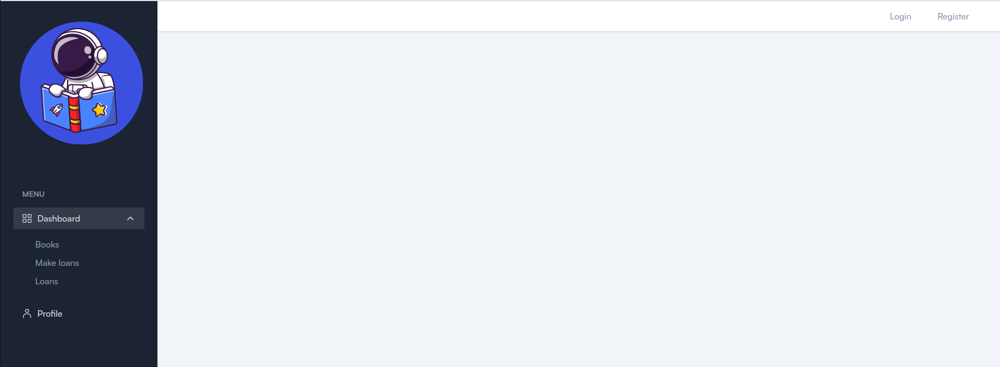
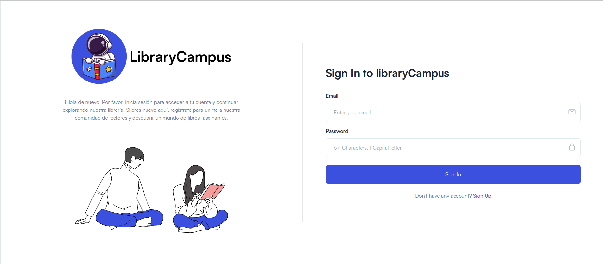
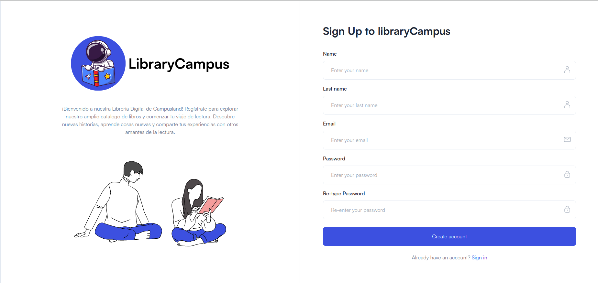

# libraryCampus

Este es un proyecto backend para una librería digital en línea. El objetivo es desarrollar un sistema que permita a los usuarios registrados explorar y disfrutar de una amplia colección de libros, así como permitir a los empleados administrativos gestionar la biblioteca. El proyecto utiliza MongoDB, React.js y Node.js como tecnologías principales. A continuación, se muestra una imagen del diagrama de la base de datos:

## Pagina principal



## Login



## Registro




## Requerimientos

Para ejecutar este proyecto, necesitarás las siguientes tecnologías y servicios:

- Node.js ([https://nodejs.org](https://nodejs.org/)) - Se recomienda la versión 18.16.0 de Node.js.
- MongoDB Atlas (https://www.mongodb.com/cloud/atlas) - Se requiere una base de datos MongoDB en línea para almacenar la información del proyecto.

## Instalación de Dependencias

Ejecuta el siguiente comando en la terminal para instalar las dependencias necesarias:

```
npm install
```

## Montar el Backend

Una vez configuradas las variables de entorno, puedes iniciar el servidor con el siguiente comando:

```
npm run dev
```

## Montar el Frontend

Para ejecutar el frontend, abre otra consola y ejecuta:

```
npm run dev
```

## Generación del Token

Para interactuar con los endpoints de la aplicación, primero debes generar un token de autenticación utilizando las siguientes credenciales de usuario y roles:

#### Rol: admin

```
makefile
Email:
admin@example.com
Password:
adminpassword
```

#### Rol: employee

```
makefile
Email:
michael.johnson@example.com
Password:
secretpassword123
```

#### Rol: customer

Puedes crear una cuenta de cliente utilizando la página de registro de la aplicación.
